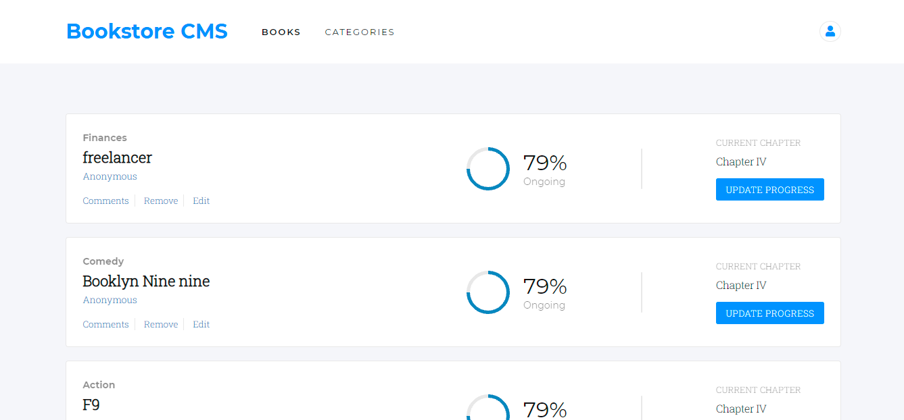
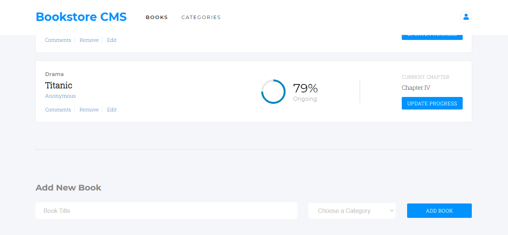

# Bookstore

The Bookstore is an MVP version build with React and Redux that allows you to display a list of books, add a book and remove a selected book.






## Live Demo

See the live [demo](https://bookstore-react-redux-aka.netlify.app/) hosted on Netlify.

## Built 

- React
- Redux
- Linters (React & Redux)
- Git

## Get Started

Please get your browser update.

. Step 1:  To get a local copy up and running follow these simple steps.
   ```
   git clone <URL> in your terminal
   ```

. Step 2: 
   ```
   cd bookstore-react-redux

   npm install

   npm run build

   npm start 
   ```

## Author

👤 **Yannick-Noel AKA**

- Location: Côte d'Ivoire
- GitHub: [@codecaiine](https://github.com/codecaiine)
- Twitter: [@yannicknaka](https://twitter.com/yannicknaka)
- LinkedIn: [LinkedIn](https://www.linkedin.com/in/yannick-no%C3%ABl-aka/)

## 🤝 Contributing

Contributions, issues, and feature requests are welcome!

Feel free to check the [issues page](https://github.com/codecaiine/bookstore-react-redux/issues).

## Show your support

Give a ⭐️ if you like this project!

## Acknowledgments

- Thanks to Microverse
- Yannick AKA

